# 1. Overview
This project develops a spatial-statistical framework to model the probability of icy surface conditions in Helsinki. ERA5 data was obtained through Google Earth Engine. The study aims to estimate where and when icy surface conditions are likely to occur across Helsinki using a grid-based dataset. The workflow combines physical reasoning and spatial statistics:

1. Construct a proxy icy-condition indicator from thermal and moisture conditions.
2. Fit a baseline binary logistic model.
3. Test whether the observed icy pattern is spatially autocorrelated.
4. Map local clusters and spatial lag structure.
5. Explore nonlinear effects with GAM smoothers.
6. Diagnose remaining spatial dependence with CAR.
7. Decompose structured and unstructured residual variation with ICAR and BYM.
8. Extend the logistic model with spatial effects.

# 2. Data and preprocessing
The study period is from December 2024 to March 2025, and the geometry is based on a 500 m grid. The original data was extracted from ERA5 dataset. The variables include snow cover, temperature, dew point, wind, precipitation, snowfall, freezing degree hours, land cover fractions, distance to water, and elevation.

### Table 1. Selected descriptive statistics for key predictors

| variable              |     mean |      std |     min |     50% |      max |
|:----------------------|---------:|---------:|--------:|--------:|---------:|
| snow_frac             |    0.563 |    0.488 |   0.000 |   1.000 |    1.000 |
| t2m_mean_c            |   -0.818 |    3.524 | -10.359 |  -0.162 |    7.768 |
| precip_sum_mm         |    1.584 |    2.415 |   0.000 |   0.651 |   16.812 |
| freezing_degree_hours |   47.269 |   59.126 |   0.000 |  22.105 |  248.619 |
| built_frac            |    0.068 |    0.159 |   0.000 |   0.000 |    1.000 |
| water_frac            |    0.875 |    0.305 |   0.000 |   1.000 |    1.000 |
| dist_to_water_mean_m  | 1951.455 | 2307.942 |   0.000 | 439.488 | 5000.000 |
| elevation_mean_m      |   25.250 |   28.328 |  -1.000 |  14.154 |  123.255 |

These summaries show a winter dataset centered near freezing conditions. The median daily mean temperature is close to 0°C, median snow fraction is 1.0, and freezing degree hours are often substantial.

# 3. Construction of the icy-condition indicator
Because direct observations of road or surface ice were not available, this study constructs a proxy probability of icy conditions. The binary target is denoted by:

$$
P_{ice,i} = \Pr(Y_i = 1)
$$

where $Y_i$ is the indicator of icy conditions for location $i$.

The physical assumption is that ice requires both favorable thermal conditions and surface moisture. The two parts are combined as:

$$
P_{ice,i} = P_{thermal,i} \times P_{moisture,i}
$$

A location cannot have high ice probability if it is thermally unsuitable, and it also cannot have high ice probability if there is no moisture source.
## 3.1 Thermal condition

The thermal part of the model contains three components.

### (a) Temperature proximity to freezing

$$
P_{temp,i} = \exp\left(-\frac{T_i^2}{2\sigma_T^2}\right)
$$

Where $T_i$ is the daily mean temperature. $\sigma_T$ indicates quickly the function decays as temperature moves away from 0°C. This term is largest near the freezing point because ice formation is often most likely close to 0°C.

### (b) Freeze–thaw transition

$$
P_{ft,i} = \beta_{ft} \cdot I(CZ > 0)
$$

Where $I(CZ > 0)$ is an indicator that temperature crossed 0°C, and $\beta_{ft}$ is a fixed boost. Crossing the freezing point creates melt–refreeze conditions, which are especially favorable for slippery surfaces.

### (c) Freezing degree hours

$$
P_{fdh,i} = 1 - \exp(-\lambda_{fdh} FDH_i)
$$

Where $FDH_i$ is freezing degree hours. This is a saturating curve. Short freezing exposure raises risk quickly, while very long exposure does not increase the probability indefinitely.

The three thermal components are combined as:

$$
P_{thermal,i} = w_{temp} P_{temp,i} + w_{ft} P_{ft,i} + w_{fdh} P_{fdh,i}
$$

The result is then clipped to the interval $[0,1]$.
## 3.2 Moisture condition

The moisture part combines snow-related and rain-related terms.

### (a) Snow contribution

$$
P_{snow,i} = \min\left(1, \frac{S_i}{\theta_{snow}}\right)
$$

Where $S_i$ is snow fraction and $\theta_{snow}$ is the threshold at which snow is treated as sufficient moisture supply.

### (b) Snowfall contribution

$$
P_{snowfall,i} = \beta_{snowfall} \cdot I(SF > 0)
$$

This gives an additional boost when fresh snowfall occurs. The total snow-related term is:

$$
P_{snow,total,i} = \min(1, P_{snow,i} + P_{snowfall,i})
$$

### (c) Rain contribution

$$
P_{rain,i} = 1 - \exp(-\gamma_{rain} R_i)
$$

Where $R_i$ is daily precipitation. This is a saturating function. Small amounts of rainfall raise surface wetness quickly, while additional rainfall has diminishing marginal effect.

### (d) Total effect of snow and rain

The moisture term is computed as the union probability:

$$
P_{moisture,i} = 1 - (1 - P_{snow,total,i})(1 - P_{rain,i})
$$

The union of the probabilities prevents double counting when both rain and snow are present.

## 3.3 Thresholding to obtain the binary target

The final proxy probability is converted to a binary indicator using a threshold $\tau$:

$$
Y_i = I(P_{ice,i} \ge \tau)
$$

### Table 2. Parameters used in the icy-condition indicator

| Component                   | Symbol     |   Value |
|:----------------------------|:-----------|--------:|
| Temperature kernel width    | σ_T        |   1.500 |
| Freezing degree hour rate   | λ_fdh      |   0.080 |
| Rainfall moisture rate      | γ_rain     |   0.350 |
| Snow fraction threshold     | θ_snow     |   0.100 |
| Freeze-thaw boost           | β_ft       |   0.250 |
| Snowfall boost              | β_snowfall |   0.150 |
| Thermal weight: temp        | w_temp     |   0.600 |
| Thermal weight: freeze-thaw | w_ft       |   0.200 |
| Thermal weight: FDH         | w_fdh      |   0.200 |
| Binary threshold            | τ          |   0.300 |

### Table 3. Summary of the constructed icy-condition probability

| stat   |       ice_prob |
|:-------|---------------:|
| count  | 1644511 |
| mean   |       0.182688 |
| std    |       0.201142 |
| min    |       0.000000 |
| 25%    |       0.025067 |
| 50%    |       0.115740 |
| 75%    |       0.253412 |
| max    |       0.835725 |

The mean proxy ice probability is 0.183, with a median of 0.116 and an upper quartile of 0.253. The proxy target is not dominated by extremely high values.

### Table 4. Class distribution of the binary icy-condition flag

| Class       |   Count |   Proportion |
|:------------|--------:|-------------:|
| Non-icy (0) | 1302898 |       0.79 |
| Icy (1)     |  341613 |       0.21 |

The Icy condition represents about 20.8% of observations. There is an imbalance between the 2 conditions, but this is expected as it is unreasonable to assume Helsinki to be icy half of winter.

# 4. Base binary logistic model

After constructing the binary target, the study fits a baseline logistic regression:

$$
Y_{it} \sim \text{Bernoulli}(p_{it})
$$

$$
\text{logit}(p_{it}) = \beta_0 + \sum_{k=1}^K \beta_k x_{k,it}
$$

Where $x_{k,it}$ are the predictors for grid cell $i$ on day $t$, and $\beta_k$ are regression coefficients. 

The predictors are grouped into three main types:

1. Lag-1 meteorology: temperature, dew point, wind, precipitation, snowfall, snow fraction, snow index, freezing degree hours, and freeze–thaw hours.
2. Persistence variables: rolling 3-day snow, freeze–thaw, FDH, precipitation, snowfall, and temperature summaries.
3. Environmental and spatial variables: built fraction, vegetation fraction, tree fraction, water fraction, distance to water, elevation, coastal exposure, urban intensity, and interaction terms.

## 4.1 Validation strategy

Three validation approaches were tested because observations are not independent across space and time:

- Random date split
- Date-based holdout
- Spatial block holdout

### Table 5. Performance of the base model under different validation strategies

| split                 |   n_train |   n_test |   roc_auc |   pr_auc |   brier |
|:----------------------|----------:|---------:|----------:|---------:|--------:|
| Random date split     |     51444 |    14143 |    0.5919 |   0.4196 |  0.2465 |
| Date-based holdout    |     41723 |    23864 |    0.4285 |   0.1341 |  0.1903 |
| Spatial block holdout |     53457 |    12130 |    0.8071 |   0.5724 |  0.1781 |

The spatial block holdout gives the highest apparent performance, with ROC AUC = 0.8071 and PR AUC = 0.5724. However, this was not selected as the main result because the practical goal is forecasting in time, not only interpolation across space. For that reason, the date-based holdout is the most relevant evaluation despite its current poor performance.

### Table 6. Confusion matrix for the date-based holdout

| Observed \ Predicted   |   Predicted non-icy |   Predicted icy |
|:-----------------------|--------------------:|----------------:|
| Non-icy                |               18325 |            1576 |
| Icy                    |                3963 |               0 |

The most striking result is that, at the chosen threshold, the model predicts no true positives in the future test period. This indicates that the threashold from the base model is not useful for forward prediction.

### Figure 1. ROC curve for the date-based holdout

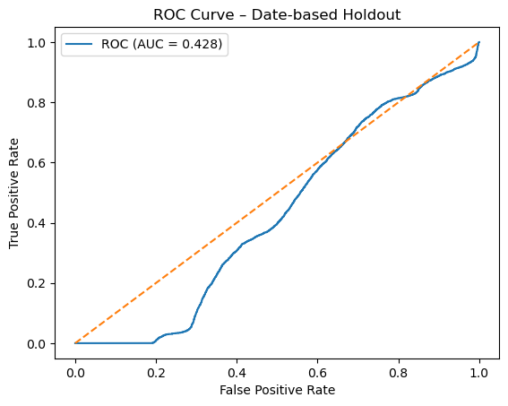

The ROC curve falls below or close to the diagonal reference, which indicates poor ranking ability. A useful discrimination model should stay clearly above the diagonal.

### Figure 2. Precision–recall curve for the date-based holdout

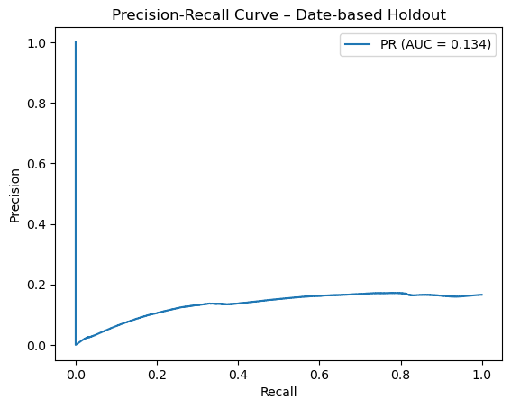

The precision–recall curve remains low. This is consistent with the low PR AUC and with the model’s difficulty in detecting icy events.

### Figure 3. Predicted probability distributions for icy and non-icy cases

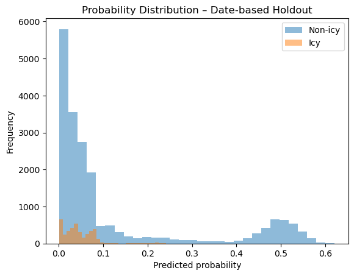

The two probability distributions overlap strongly. That means the base model does not produce a clear separation between the two classes.

# 5. Generalized Additive Model (GAM)

Next, let's focus on the nonlinear effect of the predictors with GAM:

$$
Y_i \sim \text{Bernoulli}(p_i)
$$

$$
\text{logit}(p_i) = \beta_0 + f_1(x_{1i}) + f_2(x_{2i}) + \cdots + f_k(x_{ki})
$$

Where $f_j(\cdot)$ are smooth functions estimated from the data.

Many icing processes are not linear. For example:

- temperature often has a peak effect near 0°C,
- snow and precipitation often show threshold behavior,
- coastal and terrain effects usually change gradually rather than abruptly.

### Table 8. GAM performance by predictor group

| group             |   n_features |   n_train |   n_test |   roc_auc |   pr_auc |   brier |
|:------------------|-------------:|----------:|---------:|----------:|---------:|--------:|
| Environmental     |            6 |     41723 |    23864 |    0.4455 |   0.1424 |  0.1427 |
| Spatial           |            9 |     41723 |    23864 |    0.4036 |   0.1317 |  0.1443 |
| Persistence       |            6 |     41723 |    23864 |    0.3992 |   0.1284 |  0.2078 |
| Lag-1 meteorology |           12 |     41723 |    23864 |    0.3851 |   0.1286 |  0.6530 |

Among the tested GAM groups, the environmental variables perform best, with ROC AUC = 0.4455. Even though the model performance is still weak, it suggests that static environmental context carries more predictive signal than lagged meteorology.

### Figure 7. GAM smooth terms for thermal and moisture-related predictors

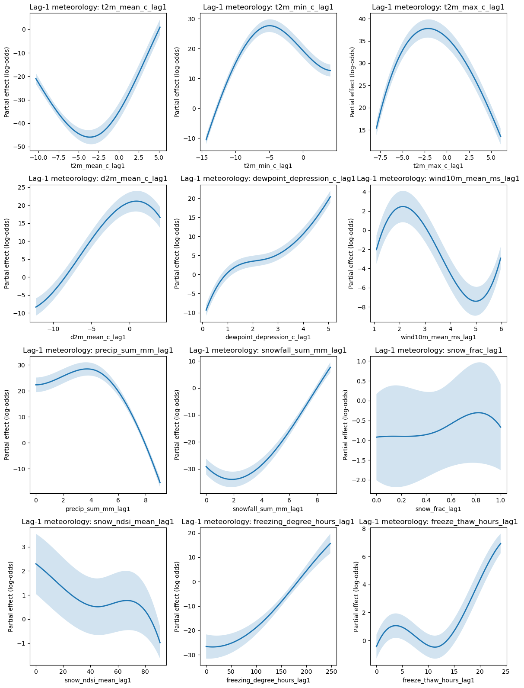

Temperature effects peak near 0°C. This is expected as very warm conditions melt ice, while very cold conditions may leave surfaces frozen but not necessarily wet and slippery. Snow and precipitation effects increase with moisture availability.

### Figure 8. GAM smooth terms for persistence variables

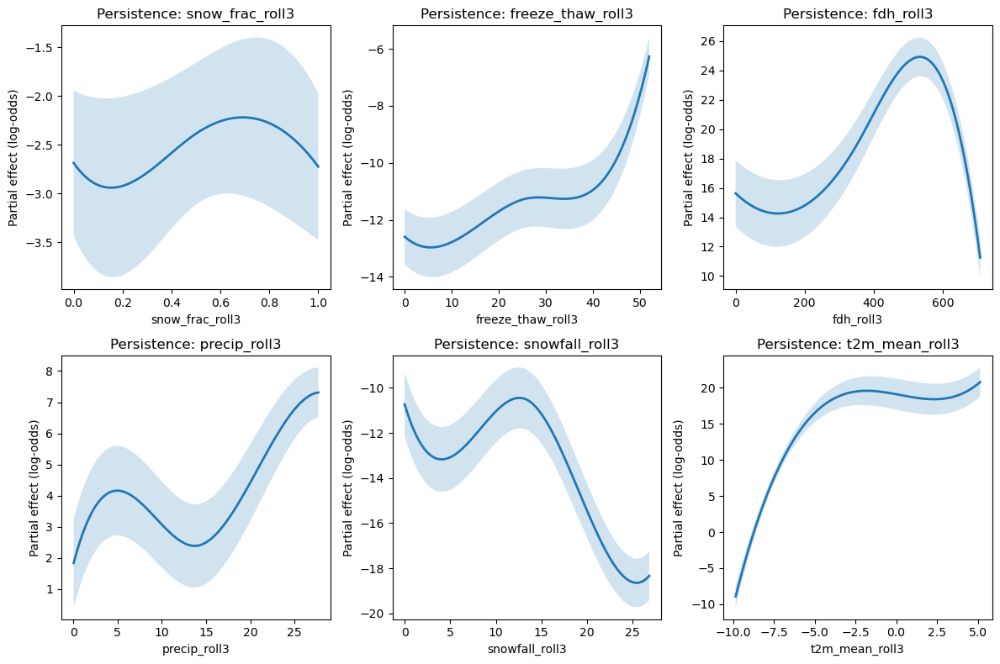

Icy conditions depends on accumulation over several days, not only same-day weather.

### Figure 9. GAM smooth terms for distance-to-water and urban variables

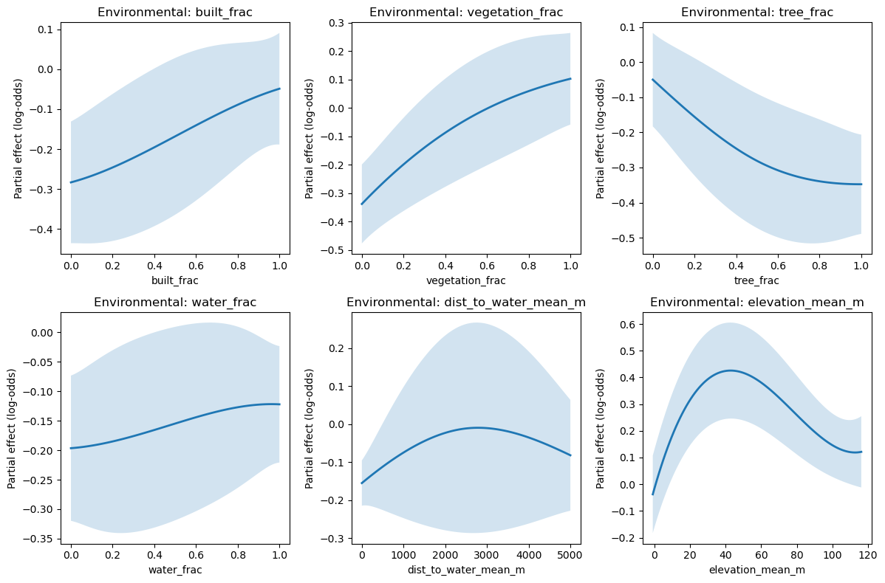

The effect generally decreases with distance to water, which is consistent with coastal thermal moderation. Urban variables show nonlinear and sometimes weak effects because different urban surfaces can both reduce and increase icing risk depending on local conditions.

### Figure 10. GAM smooth terms for spatial interaction variables

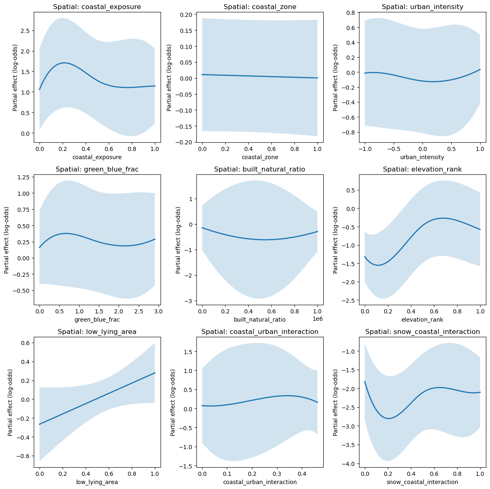

The coastal influence and snow effects interact gradually across space rather than through a sharp boundary.

# 6. Global spatial autocorrelation

The next question is whether the observed icing pattern is spatially clustered. This is tested using Global Moran’s $I$:

$$
I = \frac{N}{W}
\cdot
\frac{\sum_{i=1}^N \sum_{j=1}^N w_{ij} (x_i - \bar{x})(x_j - \bar{x})}{\sum_{i=1}^N (x_i - \bar{x})^2}
$$

where:

- $N$ is the number of spatial units,
- $x_i$ is the icy-condition rate in cell $i$,
- $\bar{x}$ is the mean rate,
- $w_{ij}$ is the spatial weight between cells $i$ and $j$,
- $W = \sum_i \sum_j w_{ij}$.

The notebook uses a **Queen contiguity** weights matrix, so two cells are neighbors if they share a border or a corner. The weights are row-standardized so that each cell receives equal total influence from its neighbors.

Under the null hypothesis of spatial randomness:

$$
\mathbb{E}[I] = -\frac{1}{N-1}
$$

## Result

- Moran’s $I$ = 0.95
- Expected $I$ = -0.000074
- Z-score = 218.86
- Permutation p-value = 0.001

This is an strong positive spatial autocorrelation. Nearby grid cells tend to have very similar icy-condition rates. In other words, icing is not randomly scattered across the city.

# 7. Local Moran’s I and spatial lag

Global Moran’s $I$ shows that clustering exists overall, but it does not tell us where the clusters are. For this, the study uses Local Moran’s $I$:

$$
I_i = z_i \sum_{j=1}^N w_{ij} z_j
$$

where:

$$
z_i = \frac{x_i - \bar{x}}{s}
$$

and

$$
s = \sqrt{\frac{1}{N} \sum_{i=1}^N (x_i - \bar{x})^2}
$$

Local Moran’s $I$ identifies:

- High–High clusters: high values surrounded by high values,
- Low–Low clusters: low values surrounded by low values,
- High–Low or Low–High are outliers.

### Table 7. Local Moran cluster counts

| Cluster         |   Count |
|:----------------|--------:|
| High-High       |    4638 |
| Low-Low         |    4109 |
| Low-High        |       8 |
| High-Low        |       0 |
| Not significant |    4836 |

The main clusters are High–High and Low–Low, while spatial outliers are rare.

### Figure 4. Local Moran’s I cluster map

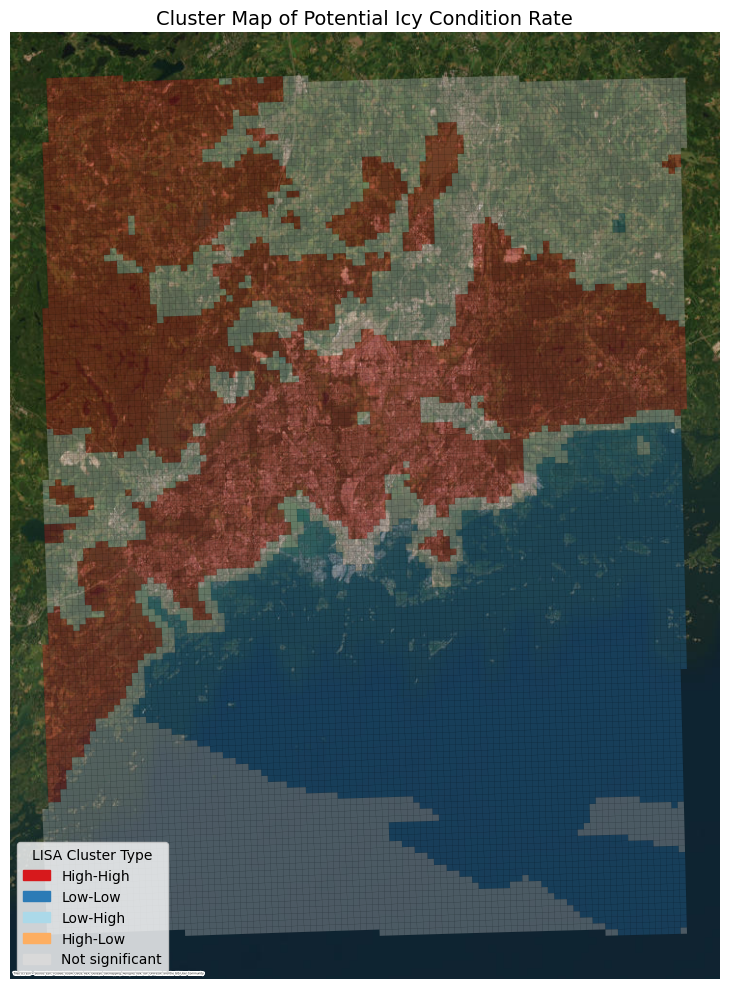

The central and southern inland urban region is dominated by High–High clusters, while the southern coastal areas tend to show low-icing conditions. Inland urban cells may experience repeated freeze–thaw behavior and local surface retention, while coastal areas are moderated by nearby water.

The spatial lag of icy-condition rate is defined as:

$$
(Wx)_i = \sum_{j=1}^N w_{ij} x_j
$$

The spatial lag is the average value in neighboring cells.

### Figure 5. Moran scatterplot / spatial lag scatterplot

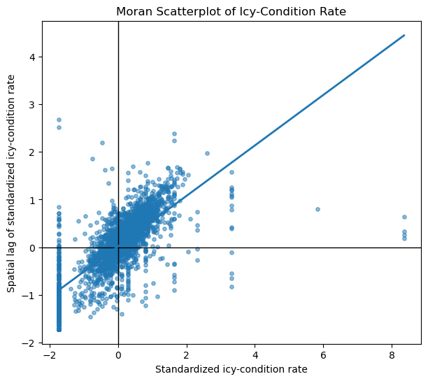

The scatterplot is organized into the four quadrants. A concentration of points in the High–High and Low–Low quadrants confirms positive clustering.

### Figure 6. Spatial lag map

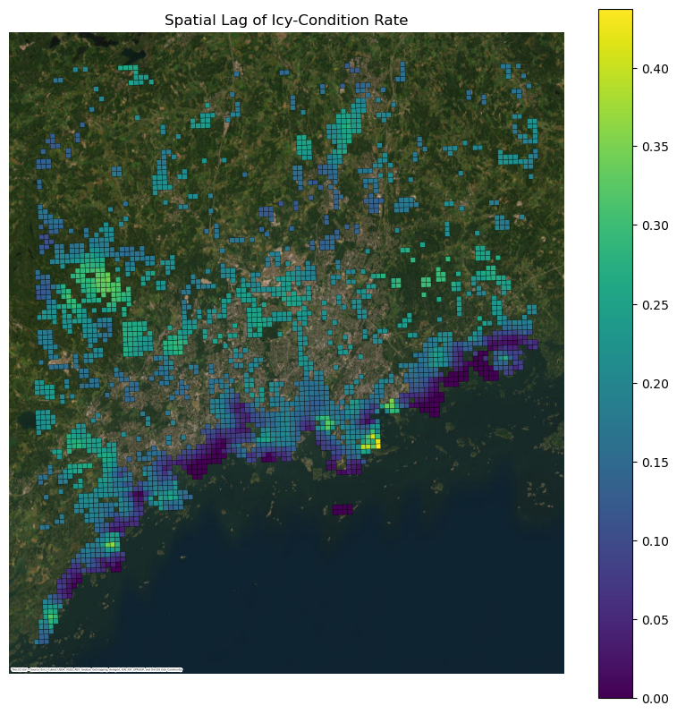

There is a clear low-lag coastal band along the southern shoreline and higher lag values farther inland. This means coastal cells are generally surrounded by similarly low-icing neighbors, while inland cells are surrounded by neighborhoods with higher icing rates.

# 8. CAR residual diagnostics

Because the base model leaves clear spatial structure, the study applies a conditional autoregressive (CAR) diagnostic model to residuals. The CAR conditional distribution is written as:

$$
u_i \mid u_{-i} \sim N\left(
\frac{\rho \sum_{j \in N_i} w_{ij} u_j}{\sum_{j \in N_i} w_{ij}},
\frac{\tau^2}{\sum_{j \in N_i} w_{ij}}
\right)
$$

where:

- $u_i$ is the spatial effect at cell $i$,
- $u_{-i}$ are all other spatial effects,
- $\rho$ is the spatial dependence parameter,
- $\tau^2$ is the variance parameter.

Pearson residuals from the logistic model is calculated as:

$$
r_i^{(P)} = \frac{y_i - p_i}{\sqrt{p_i(1-p_i)}}
$$

### Table 9. Residual Local Moran cluster counts after the base model

| Residual cluster   |   Count |
|:-------------------|--------:|
| Not significant    |    1546 |
| High-High          |     374 |
| Low-Low            |     287 |
| Low-High           |      61 |
| High-Low           |      18 |

Residual High–High and Low–Low clusters remain, which means the non-spatial model still leaves structured errors.

### Table 10. Residual Moran’s I by built-environment group

| Built-environment group   |   Cells |   Residual Moran I |   Expected I |   Z-score |   Permutation p |
|:--------------------------|--------:|-------------------:|-------------:|----------:|----------------:|
| Less built                |    1143 |           0.5081 |    -0.000876 | 40.6882 |        0.0010 |
| More built                |    1143 |           0.3521 |    -0.000876 | 28.2269 |        0.0010 |

Residual spatial autocorrelation is stronger in the less built group than in the more built group. This indicates that the strength of spatial dependence is not fully stationary across land-use contexts.

### Result of distance-band dependence check

- Intercept = -0.037
- Local lag coefficient = 0.92
- Mid-range coefficient = -0.18
- Far-range coefficient = -0.065
- $R^2$ = 0.63

The high value of the local-lag coefficient shows that nearby cells drive most of the residual spatial dependence.

### Figure 11. CAR distance-band dependence plot

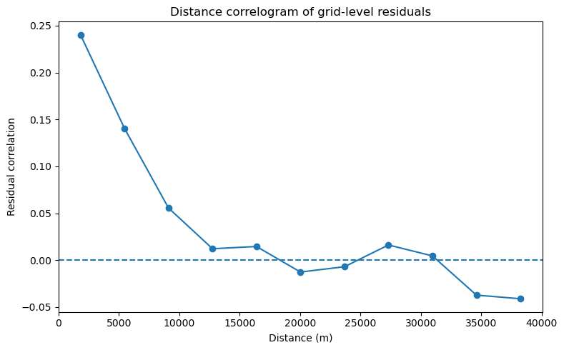

The figure indicates that nearby cells have strong influence, and the dependence decays with distance.

# 9. ICAR and BYM decomposition

## 9.1 ICAR model

The intrinsic CAR (ICAR) model is written as:

$$
u_i \mid u_{-i} \sim N\left(
\frac{\sum_{j \in N_i} w_{ij} u_j}{\sum_{j \in N_i} w_{ij}},
\frac{\sigma_u^2}{\sum_{j \in N_i} w_{ij}}
\right)
$$

This formulation removes the explicit autoregressive scaling and instead penalizes neighboring cells that differ strongly. It is widely used for areal spatial smoothing.

### Table 11. ICAR variance decomposition and spatial diagnostics

| Quantity                            |     Value | Permutation p   |
|:------------------------------------|----------:|:----------------|
| Residual variance                   |  0.3262 | -               |
| Structured variance                 |  0.3262 | -               |
| Remainder variance                  |  0.000462 | -               |
| Residual Moran's I                  |  0.5744 | 0.001           |
| Structured Moran's I                |  0.6088 | 0.001           |
| Remainder Moran's I                 |  0.2771 | 0.001           |
| Correlation (structured, remainder) | -0.0188 | -               |

The structured variance is 0.3262, while the remainder variance is only 0.000462. In other words, almost all residual variation is absorbed by the structured spatial field. The remainder is small.

### Figure 12. ICAR structured and remainder fields

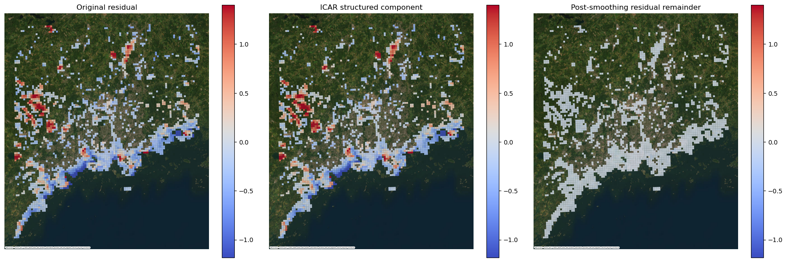

The ICAR smoother captures most of the areal spatial pattern, leaving only a very small remainder field.

## 9.2 BYM decomposition

The BYM framework will further exmaine the structured and unstruced effect as:
$$
\eta_i = \mathbf{x}_i^\top \boldsymbol{\beta} + u_i + v_i
$$
Where:
- $u_i$ is the structured spatial effect, and
- $v_i$ is the unstructured effect.

### Table 12. BYM decomposition summary

| Quantity                               |     Value |
|:---------------------------------------|----------:|
| Residual variance                      |  0.3262 |
| Structured variance                    |  0.3262 |
| Unstructured variance                  |  0.000462 |
| Correlation (structured, unstructured) | -0.01882 |

Again, the unstructured part is very small compared with the structured part. This indicates that the unexplained variation is mainly spatially organized rather than independent noise.

### Figure 13. BYM structured vs. unstructured spatial fields

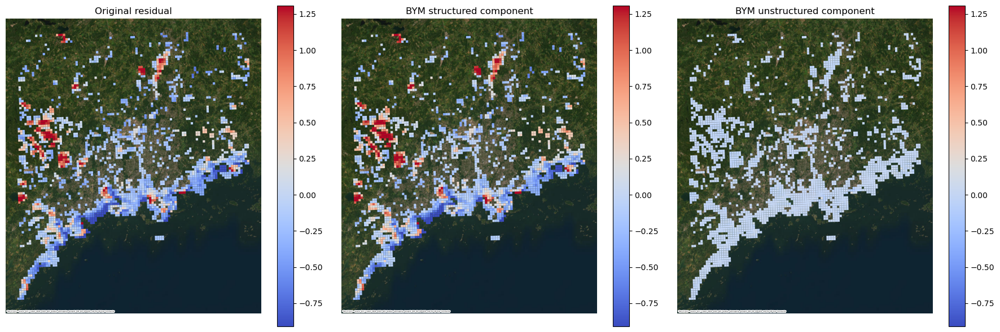

The residual field is almost entirely explained by the structured component, with only a negligible unstructured remainder.
# 10. Bayesian-style spatial logistic model

After understanding the non-linear effects of the predictors and the autocorrelation of the icy conditions, the final section extends the logistic model with spatial random effects:

$$
Y_i \sim \mathrm{Bernoulli}(p_i)
$$

$$
\mathrm{logit}(p_i) = \mathbf{x}_i^\top \boldsymbol{\beta} + u_i + v_i
$$

This combines fixed effects from predictors with spatial effects. The structured spatial penalty is:

$$
\lambda_u \, u^\top Q u
$$

where $Q$ is the graph-based spatial precision matrix and $\lambda_u$ controls the degree of smoothing.

The penalized negative log-likelihood is:

$$
\mathcal{L} = -\sum_i \left[
y_i \log(p_i) + (n_i - y_i)\log(1-p_i)
\right] + \lambda_u u^\top Q u
$$

This form encourages neighboring cells to have similar structured effects.

### Model fit summary

- Objective value = **42560.970936**
- Mean binomial log-loss = **18.618098**

### Table 13. Moran’s I of the spatial-logistic components

| Component           |   Moran I |   Permutation p |
|:--------------------|----------:|----------------:|
| Structured effect   |  0.7685 |        0.001000 |
| Unstructured effect |  0.2771 |        0.001000 |
| Residual            |  0.5550 |        0.001000 |

The structured spatial effect remains highly clustered, while the residual field still has nonzero spatial autocorrelation. Much of the large-scale coastal-to-inland spatial pattern is represented by the structured component.

### Figure 14. Structured spatial pattern from the final spatial logistic model

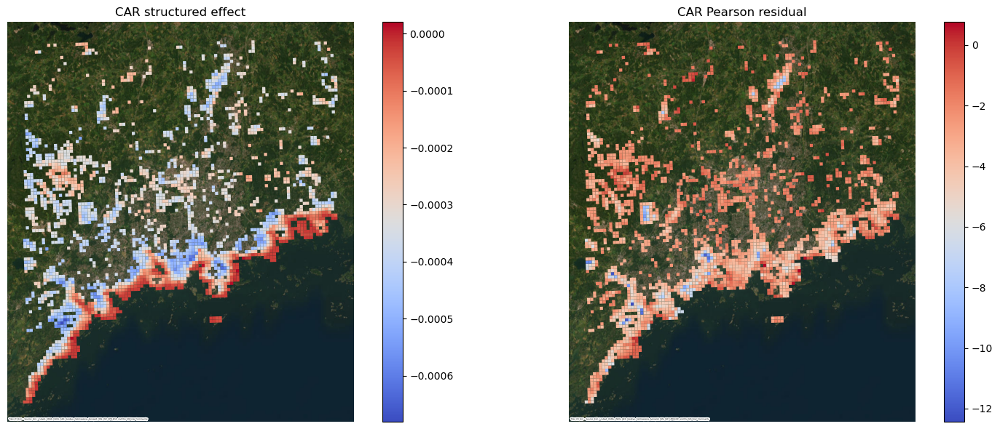

The map is shows that there is a strong coastal signal and a clear inland transition zone. This is consistent with the coastal moderation reduces icing relative to inland areas.

### Table 14. Coefficients from the spatial logistic model

| Direction   | feature                    |   beta_hat |
|:------------|:---------------------------|-----------:|
| Positive    | snow_frac_lag1             |   0.104983 |
| Positive    | snow_ndsi_mean_lag1        |   0.102320 |
| Positive    | coastal_exposure           |   0.100877 |
| Positive    | snow_frac_roll3            |   0.096209 |
| Positive    | water_frac                 |   0.095673 |
| Positive    | snow_coastal_interaction   |   0.094506 |
| Positive    | low_lying_area             |   0.078144 |
| Positive    | d2m_mean_c_lag1            |   0.057097 |
| Negative    | vegetation_frac            |  -0.093303 |
| Negative    | dewpoint_depression_c_lag1 |  -0.086908 |
| Negative    | elevation_rank             |  -0.081861 |
| Negative    | built_frac                 |  -0.071978 |
| Negative    | elevation_mean_m           |  -0.069868 |
| Negative    | tree_frac                  |  -0.056786 |
| Negative    | dist_to_water_mean_m       |  -0.041223 |
| Negative    | freezing_degree_hours_lag1 |  -0.040452 |

The strongest positive effects are snow-related variables, coastal exposure, water fraction, and the snow–coast interaction. The strongest negative effects are vegetation fraction, dewpoint depression, and elevation-related variables.

- more snow and persistent snow increase both moisture availability and persistence of icy surfaces,
- coastal exposure and nearby water align with the observed spatial gradient,
- larger dewpoint depression indicates drier air, which may reduce frost or surface wetness,
- higher vegetation and higher elevation ranking are associated with lower fitted icing risk in this dataset.

# 11. Conclusion

First, the very high Global Moran’s $I$, the local clustering, and the residual spatial diagnostics all show that icy conditions are not independent across neighboring cells.

Second, the base non-spatial logistic model is not adequate for forward prediction. It performs poorly on the date-based holdout, which is the most realistic forecasting test in this study.

Third, structured spatial variation dominates the residual field. Both ICAR and BYM decomposition show that the unexplained pattern is mostly spatially smooth rather than random.

Fourth, snow, water, coast, and freeze–thaw processes are the most important physical drivers. These effects appear repeatedly in the proxy indicator, the GAM interpretation, and the final spatial logistic coefficients.
